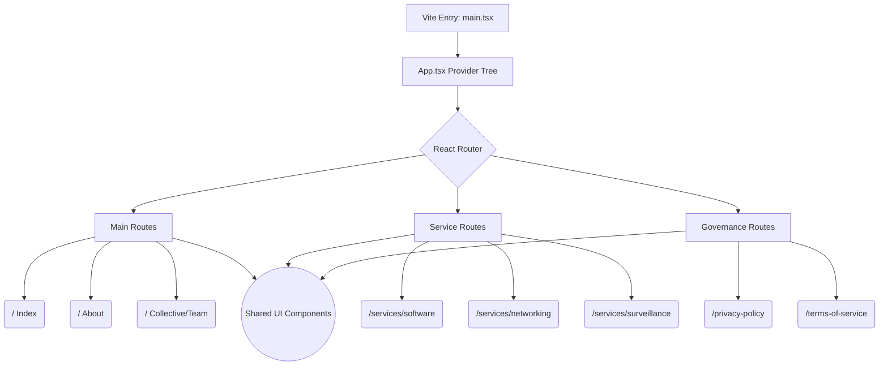

### Repository Metadata

**GitHub Repository Description**
The official corporate web portal for Spirecrest Solutions, showcasing enterprise IT infrastructure, surveillance, and scalable software services in India.

**Elevator Pitch**
Spirecrest Ascent is the comprehensive digital front-door for Spirecrest Solutions. Built on a modern, high-performance stack utilizing React, Vite, and TypeScript, the platform serves as a B2B portal to showcase a diverse array of enterprise-grade services. From network architecture and software development to full-scale automation, the repository is structured to perfectly support the firm's strategic "Ground Zero" restructuring, highly emphasizing its unique partner-led, profit-sharing business model to prospective clients and future directors alike.

**GitHub Topics**
`react`, `vite`, `typescript`, `tailwind-css`, `shadcn-ui`, `enterprise-it`, `corporate-website`, `b2b-portal`, `frontend-architecture`, `spirecrest-solutions`

---

### Complete README.md

```markdown
# Spirecrest Ascent 🚀

> The official digital portal and service catalog for Spirecrest Solutions.


## 📖 Overview

**Spirecrest Ascent** is the enterprise web frontend for Spirecrest Solutions. Designed to interface with India's most critical enterprises, this platform outlines our comprehensive service offerings—ranging from custom software engineering and IT infrastructure to surveillance, automation, and solar deployments. 

The architecture reflects our partner-led operational model, establishing a high-trust digital footprint for B2B client acquisition, stakeholder engagement, and director-level recruitment. 

## ✨ Features

- **Service Deep-Dives:** Dedicated routing for specialized services including Software, Lifecycle Consulting, AV Studio, Networking, and more.
- **Partner-Led Architecture:** Highlighting the core collective and partnership models driving the business forward.
- **Dark-Mode First:** Enforced dark theme utilizing Tailwind CSS for a sleek, modern, and authoritative corporate aesthetic.
- **Accessible UI:** Built entirely on Radix UI primitives via `shadcn/ui` for robust accessibility and cross-browser consistency.
- **Performance Optimized:** Fast bundling and HMR driven by Vite and SWC.
- **SEO Ready:** Integration with `react-helmet-async` for optimized metadata across all dynamic routes.

## 🛠️ Tech Stack

| Category | Technology | Description |
| :--- | :--- | :--- |
| **Framework** | React 18 | Core UI library |
| **Build Tool** | Vite | Next-generation frontend tooling (with SWC) |
| **Language** | TypeScript | Strongly typed JavaScript for enterprise reliability |
| **Styling** | Tailwind CSS | Utility-first CSS framework |
| **Components** | shadcn/ui | Reusable component system based on Radix UI |
| **Routing** | React Router v6 | Client-side routing for the Single Page Application |
| **Data Fetching** | React Query v5 | Asynchronous state management |
| **Animations** | Framer Motion | Fluid, physics-based animations |

## 📐 Architecture

Spirecrest Ascent follows a modular Single Page Application (SPA) architecture. The routing layer handles traffic division between primary marketing pages, deep-dive technical service pages, and strictly formatted governance documents. 



## 📂 Project Structure

```text
spirecrest-ascent/
├── public/                 # Static assets, favicon, OG images
├── src/
│   ├── assets/             # Local images and branding materials
│   ├── components/         # Reusable React components
│   │   ├── about/          # About page specific sections
│   │   ├── services/       # Service page specific sections
│   │   └── ui/             # shadcn/ui primitive components
│   ├── hooks/              # Custom React hooks (e.g., use-mobile)
│   ├── lib/                # Utility functions (Tailwind merges, formatting)
│   ├── pages/              # Route entry points
│   │   ├── governance/     # Legal and compliance pages
│   │   └── services/       # Individual service category pages
│   ├── App.tsx             # Root component and Router definition
│   └── main.tsx            # DOM mounting and initialization
├── eslint.config.js        # Linter rules
├── tailwind.config.ts      # Tailwind design system configuration
└── vite.config.ts          # Vite bundler configuration

```

## 🚀 Installation

Ensure you have [Node.js](https://nodejs.org/) (v18+) installed.

```bash
# 1. Clone the repository
git clone [https://github.com/cyberghost3301/spirecrest-ascent.git](https://github.com/cyberghost3301/spirecrest-ascent.git)

# 2. Navigate to the directory
cd spirecrest-ascent

# 3. Install dependencies
npm install

```

## 💻 Usage

### Development

Start the development server with Hot Module Replacement (HMR):

```bash
npm run dev

```

The application will be available at `http://localhost:8080` (or the next available port).

### Building for Production

To create an optimized production build:

```bash
npm run build

```

Preview the built artifacts locally:

```bash
npm run preview

```

## ⚙️ Configuration

The project utilizes standard Vite environment variables. Create a `.env` file in the root directory for any local overrides.

*Note: All environment variables exposed to the Vite frontend must be prefixed with `VITE_`.*

## 🔌 API or Modules

While primarily a frontend presentation layer, the application is pre-configured with `@tanstack/react-query` to seamlessly integrate with future backend services (e.g., centralized resource hubs, dynamic portfolio fetching, or CRM integrations for the Contact forms).

Form validations are strictly enforced using `react-hook-form` coupled with `zod` schema parsing to ensure clean data entry before any external API submissions.

## 📸 Demo

> *(Add screenshots of the dark-mode UI, service bento grids, and partner sections here)*

## 🤝 Contributing

We welcome contributions that align with Spirecrest's standard of excellence.

1. Fork the Project
2. Create your Feature Branch (`git checkout -b feature/AmazingFeature`)
3. Commit your Changes (`git commit -m 'Add some AmazingFeature'`)
4. Push to the Branch (`git push origin feature/AmazingFeature`)
5. Open a Pull Request

Please ensure all tests pass (`npm run test`) and the linter is satisfied (`npm run lint`) before submitting.

## 🗺️ Roadmap

* [ ] Implement dynamic CMS integration for the Portfolio and Testimonials sections.
* [ ] Add multilingual support (i18n) for broader enterprise reach.
* [ ] Develop an authenticated portal area for existing directors and partners to access the centralized knowledge hub.
* [ ] Integrate advanced analytics to track B2B conversion metrics on the Partner Model workflows.

## 📄 License

Distributed under the MIT License. See `LICENSE` for more information.

```

```
